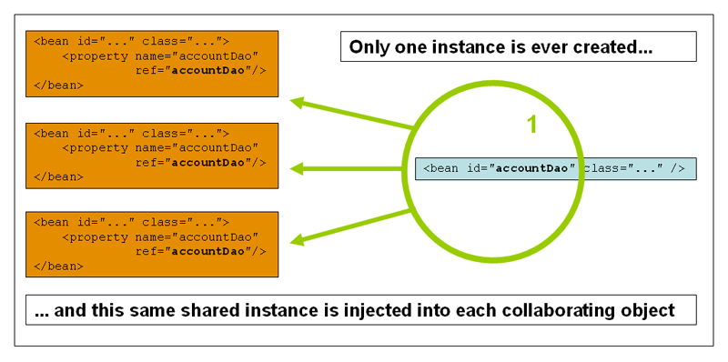
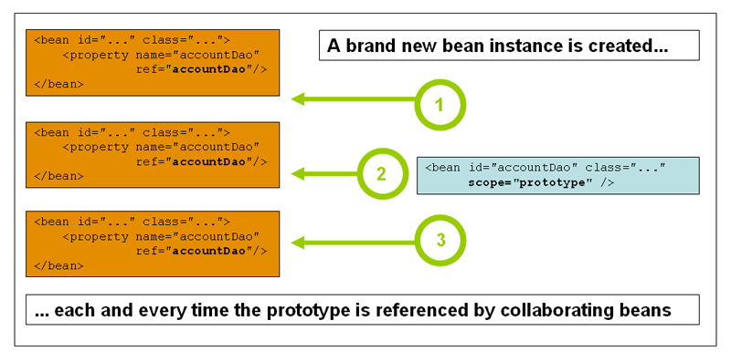

#### Intrudoction


#### Container overview

``ApplicationContext``代表SpringIOC container，并且负责实例、配置上述bean。container通过读取配置来获取bean的实例化、配置和组装信息。
配置信息可以从xml、Java注解或者java代码获取。

在ApplicationContext被创建和实例化后，你的项目代码和配置信息进行关联，形成一个完成的项目applcation。


##### Configuration metadata
通常使用xml形式的配置信息，或者Java注解配置、Java代码配置

xml中使用``<bean/>``作为顶层信息，``<bean>``作为元素。
Java配置使用```@Configuration``作用到类，``@Bean``注解到方法

##### Instantiating a container

可以直接通过``ClassPathXmlApplicationContext``获取到xml文件，然后获取ApplicationContext
```
ApplicationContext context = new ClassPathXmlApplicationContext("services.xml", "daos.xml");
```

如果有多个xml配置，可以合并成一个xml,通过``<import>``导入
```
<beans> 
    <import resource="services.xml"/>
    <import resource="resources/messageSource.xml"/>
    <import resource="/resources/themeSource.xml"/>

    <bean id="bean1" class="..."/>
    <bean id="bean2" class="..."/>
</beans>
```

##### Using container
ApplicationContext接口是高级的工厂模式，维护一个bean的注册表以及之间的依赖关系，可以使用
```T getBean(String name, Class<T> requiredType)``获取一个bean的实例


#### Bean overview

Spring IoC容器管理一个或多个bean，由提供给容器的配置文件生成，例如xml的``<bean>``
在容器内部，这些bean被定义为BeanDefinition对象，并且有以下的配置信息：
+ 包全限定名：具体实现类的类名
+ bean的行为配置，代表bean在容器的行为（scope作用域，lifecycle callbacks生命周期）
+ 引用的其他bean，依赖
+ 其他配置，

除了配置的bean，ApplicationContext还允许注册外部的bean到容器中

##### Naming bean
id用来标识唯一，name可以有多个
可以通过``<alias>``命名别名

##### Instantiating bean初始化bean

bean definition本质上是创建bean的配方，容器使用配置元素创建bean

通过有两种方式创建bean：
+ 通过默认的构造函数，反射创建bean，和new关键字作用相同
> 需要一个默认的无参构造器
+ 通过static 工厂方法创建
> 通过``factory-method``配置一个静态工厂方法

+ 或者通过非静态工厂方法，不过需要bean单独定义，并且通过factory-bean参数设置，factory-method设置方法
> 
```
<bean id="serviceLocator" class="examples.DefaultServiceLocator">
    <!-- inject any dependencies required by this locator bean -->
</bean>

<!-- the bean to be created via the factory bean -->
<bean id="clientService"
    factory-bean="serviceLocator"
    factory-method="createClientServiceInstance"/>
```

#### Dependencies

##### Dependency Injection
依赖注入

Constructor-based injection 构造器注入
可以直接构造器
```
public class SimpleMovieLister {

    // the SimpleMovieLister has a dependency on a MovieFinder
    private MovieFinder movieFinder;

    // a constructor so that the Spring container can inject a MovieFinder
    public SimpleMovieLister(MovieFinder movieFinder) {
        this.movieFinder = movieFinder;
    }
}
```
构造器参数可以通过constructor-arg设定
```
<beans>
    <bean id="foo" class="x.y.Foo">
        <constructor-arg ref="bar"/>
    </bean>

    <bean id="bar" class="x.y.Bar"/>
</beans>
```

Setter-based dependency injection set方法注入

Dependency resolution process bean的解析过程
+ 根据描述所有的bean的配置文件，ApplicationContext创建并且初始化。配置文件来自于xml，java code或注解
+ 每个bean的依赖被表现在属性、构造器参数或者static工厂参数。只有当bean实际被创建时才会注入依赖
+ 每个属性、构造器参数都是实际值，要么set、list或者其他的bean
+ 每个属性、构造器参数都会被转成实际的类型

Spring会验证bean的配置。bean的属性只有在实际创建时才会被创建注入。作用域时 singleton-scoped的bean会跟着容器一起被实例化。其他的bean都是需要的时候才创建，也就是请求这些bean的时候才会被
创建。

Spring检测到循环依赖的时候，就会抛出 BeanCurrentlyInCreationException异常。可能的解决办法有使用set注入而不是构造器注入

Bean的引用

通常使用``ref``元素引用其他bean，引用bean 的id或者其中一个name

如果parent context已经定义一个bean，在子的context我们如果重新定义一个相同id 的bean就会覆盖，或者通过``org.springframework.aop.framework.ProxyFactoryBean``
把parent context的bean引用过来
```
<!-- in the parent context -->
<bean id="accountService" class="com.foo.SimpleAccountService">
    <!-- insert dependencies as required as here -->
</bean>
<!-- in the child (descendant) context -->
<bean id="accountService" <!-- bean name is the same as the parent bean -->
    class="org.springframework.aop.framework.ProxyFactoryBean">
    <property name="target">
        <ref parent="accountService"/> <!-- notice how we refer to the parent bean -->
    </property>
    <!-- insert other configuration and dependencies as required here -->
</bean>
```

同``<list/>, <set/>, <map/>, and <props/>``你可以设置集合Collection

null或者empty string
```
<bean class="ExampleBean">
    <property name="email" value=""/>
</bean>
</null>
```

使用depends on
通常引用bean都是使用``<ref>``，但对于一些bean在使用前需要触发一些init初始化程序，例如数据库驱动，depends-on 可以强制bean在使用前初始化
```
<bean id="beanOne" class="ExampleBean" depends-on="manager"/>
<bean id="manager" class="ManagerBean" />
```


Lazy-initialized beans懒加载

默认情况，ApplicationContext会在启动时随着容器的初始化而将所有的single-ton的bean全都初始化。
这样做的好处在于如果有配置错误，可以第一时间知道，而不是很久之后。但也有一些bean很浪费资源，可能不需要开始的时候就加载，
就可以通过lazy-initialized配置。
```
<bean id="lazy" class="com.foo.ExpensiveToCreateBean" lazy-init="true"/>
```
这样的话，bean就会在第一次被请求时而不是启动时加载。

但是如果一个不是lazy-initailized的bean引用了一个lazy-initialized的bean，为了满足引用关系，lazy-initailized还是会在启动时被加载
就像single-ton的bean引用了prototype的bean，prototype的bean为了满足singleton的引用，会在启动时加载，但再次获取时拿到的是新的，而single-ton还是旧的，这时候就
必须使用代理来更新single-ton的prototype

Autowiring collaborators自动注入

Spring可以自动检测对象之间的关系，并自动注入。

自动注入有以下几种类型：
+ no 默认，不进行自动注入
+ byName 通过属性名称，并且属性必须有对应的set方法
+ byType 通过类型，如果检测满足类型的实例有多个会抛出异常，如果找不到，什么都不做
+ constructor 通过构造器，也是通过byType

#### Bean scopes

+ singleton 默认，单例模式
+ prototype
+ request http请求scope
+ session   
+ globalSession
+ application
+ websocket

**singleton scope**
所有的请求都是一个共享实例，并且IoC容器会缓存singleton的bean


和单例设计模式不一样，单例设计模式产生的是每个ClassLoader仅仅有一个实例，但Spring是一个context仅有一个实例

**prototype scope**
每次请求都会重新new一个对象，就是每次注入到其他bean的或者``getBean()``方法时。

通常来说，当一个bean有状态stateful，使用prototype，也就是说有自己的域，不能被其他线程共享；如果bean没有状态stateless，
我们就设置为singleton，单例，线程安全的，可以被共享。




#### Customizing the nature of a bean 

##### Lifecycle callbacks

**Lifecycle callbacks 生命周期callbacks**
为了和spring容器管理的bean的生命周期整合，你可以实现spring的``InitializingBean`` 和``DisposableBean``接口。
容器会调用``afterProertiesSet()``和``destroy()``方法在bean初始化时和被销毁时。

或者使用Java注解@PostConstruct和@PreDestroy

在内部Spring使用``BeanPostProcessor``实现bean的生命周期。

Initialization and destroy callbacks
除了使用实现接口和Java注解外，还可以使用xml的 init-method和destroy-method，和@Bean注解的initMethod和destroy方法

**Startup and shutdown 启动停止callbacks**


##### ApplicationContextAware and BeanNameAware
当ApplicationContext创建一个实现了ApplicationContextAware接口的bean时，会调用为该bean注入一个ApplicationContext
```
public interface ApplicationContextAware {
    void setApplicationContext(ApplicationContext applicationContext) throws BeansException;
}
```
然后bean就可以利用这个ApplicationContext拿到其他的bean。
或者直接通过@Autowired注解将ApplicationContext注入进去

当ApplicationContext创建一个实现BeanNameAware接口的bean时，会调用其中的``setBeanName``方法设置beanName

##### Other Aware interface
实现了Aware接口的bean表示需要Spring中基础架构的依赖

```
ApplicationContextAware 
BeanNameAware
ServletConfigAware
ServletContextAware
```

#### Container Extension points

##### Customizing beans using a BeanPostProcessor

BeanPostProcessor接口定义了方法回掉接口，可以自定义初始化和依赖逻辑。通过实现BeanPostProcessor接口可以在Spring容器初始化一个bean之后
实现自定义逻辑。通过set order属性可以控制多个BeanPostProcessor的执行顺序

BeanPostProcessor在容器初始化方法之前执行，例如初始化bean的 afterPropertiesSet()方法

BeanPostProcessor通常用来为bean做代理，SpringAOP就是实现了BeanPostProcessor接口，作为一个bean的后处理器   

Spring自动检测实现BeanPostProcessor接口的bean，然后在创建完成后执行

##### Customizing configuration metadata with a BeanFactoryPostProcessor

上述BeanPostProcessor接口是对bean进行处理，而BeanFactoryPostProcessor是对bean的配置元数据进行操作
Spring容器运行BeanFactoryPostProcessor对Bean的配置元数据进行读取，并且在bean初始化之前对其改变

一个bean的post-processor会被自动执行，当它被声明的时候。有一些默认的BeanFactoryPostProcessor，例如PropertyOverrideConfigurer和
PropertyPlaceholderConfigurer，实现bean自定义属性值，从外部的配置文件读取信息

##### Customizing instantiation logic with a FactoryBean

如果一个bean本身就是工厂模式的，为它实现FactoryBean接口
Spring自带许多FactoryBean，也可以实现自己的FactoryBean，用来创建bean

#### Annotation-based container configuration

#### Classpath scanning and managed components
@Repository注解适用于资源例如DAO层对象 持久层。
@Component、@Service、@Controller都是bean注入注解。
@Component是最通用的组件，@Repository、@Service、@Controller都是Components特殊语义化的体现。能够更好的表达组件的意思。

需用@ComponentScan扫描包和注解，Spring会自动检测注解并且注册相应的BeanDefinition

还可以使用过滤器自定义扫描
通过@ComponentScan的includeFilters 和excludeFilters 


通过@Bean可以用来设置Bean的生成，通常作用到方法上，@Qualifier设置Bean的别名name
@RequestScope和@Bean一同完成Bean的生成

@Scope用来设置bean的作用域

通过@Bean和@configuration可以基于Java代码生成bean的元数据配置信息

Spring提供AnnotationConfigApplicationContext
使用AnnotationConfigApplicationContext初始化IOC容器
可以通过AnnotationConfigApplicationContext.register的方式注册bean
或者通过扫描包AnnotationConfigApplicationContext("包")

完成注册bean之后必须执行 context.refresh()操作
自定义NameBeanGenerator方法必须放到注册前面


可以通过@Import导入别的配置文件

#### Environment abstraction
通过spring环境的 profiles和properties概念，可以实现Environment的抽象

#### Additional capabilities of ApplicationContext
