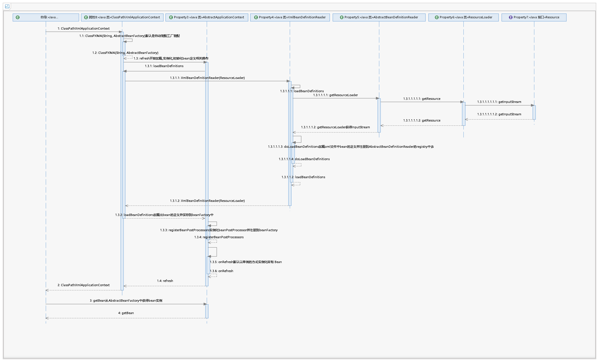

### bean目录

bean目录下分为三个子目录和部分类


### 具体流程

bean包下有factory、io、xml三个包以及其他类，
其中factory包主要包含BeanFactory的相关类

BeanFactory接口是IOC的bean容器，工厂模式提供获取的getBean

AbstractBeanFactory缺省适配模式，抽象类实现BeanFactory接口，并且包含一系列方法规范IOC容器的基本结构

```java

//三个实例域
 /**
     * 对象池，根据name作为key存储对应的bean的定义
     */
    private Map<String, BeanDefinition> beanDefinitionMap = new ConcurrentHashMap<String, BeanDefinition>();


    /**
     * 保存完成注册的bean的name
     */
    private final List<String> beanDefinitionNames = new ArrayList<String>();

    /**
     * 增加bean的处理程序
     */
    private List<BeanPostProcessor> beanPostProcessors = new ArrayList<BeanPostProcessor>();


```


### 流程

#### 基本的类

Bean的元数据，spring的bean从来不是单独一个实现，然后保存起来的，还需要一些其他的信息来完成额外的操作。
BeanDefinition就是用来封装Bean的定义类
BeanDefinition声明了Bean在IOC容器的定义，包括Bean的名字、类、属性

```java
public class BeanDefinition {
    //实际真正的bean
    private Object bean;

    //bean对应的class
    private Class beanClass;

    //bean className
    private String beanClassName;

    //bean所有的属性封装的对象
    private PropertyValues propertyValues = new PropertyValues();
}
```

PropertyValues是对PropertyValue的集合封装

包装一个对象所有的PropertyValue，一个bean不可能只有一个属性注入，所以
采用一个类单独封装一个propertyValue list。可以再次基础上对其做一些操作

```java
public class PropertyValues {

    private final List<PropertyValue> propertyValueList = new ArrayList<PropertyValue>();
}
```

而PropertyValue是用于bean的属性注入，包括属性的名称以及值
```java
public class PropertyValue {

    //bean需要注入的引用bena名称
    private final String name;
    
    //Spring xml中property中，键是key，值是value或者ref，对于value只要直接注入属性就可以，对于ref需要解析对应的bean
    private final Object value;
}
```

PropertyValues的封装而不是仅仅是使用一个list，是为了可以对list进行操作方便


BeanReference用来表示属性是对象对引用的封装，也就是如果一个bean的属性是另一个bean，可以使用这个BeanReference进行封装，
也就是说一个bean的所有其他bean的引用都是BeanReference类型的
```java
public class BeanReference {
       //引用bean的name
       private String name;
       //引用的bean
       private Object bean;
}

```

BeanPostProcessor用来定义bean初始化前后嵌入相关的操作
```java
/**
 * bean初始化前后可以做的动作
 * 用于在bean定义初始化时嵌入相关操作
 *  例如：在 postProcessorAfterInitialization 方法中，使用动态代理的方式，返回一个对象的代理对象，就可以在IOC容器中植入AOP
 * @author wukai
 * @date 2019/3/11
 */
public interface BeanPostProcessor {

    /**
     * bean初始化前可以做的动作
     * @param bean 实际的bean
     * @param beanName bean的name
     * @return
     * @throws Exception
     */
    Object postProcessBeforeInitialization(Object bean, String beanName) throws Exception;

    /**
     * bean初始化后可以做的动作
     * @param bean  实际的bean
     * @param beanName bean的name
     * @return
     * @throws Exception
     */
    Object postProcessAfterInitialization(Object bean, String beanName) throws Exception;
}
```
当需要在初始化bean的时候前置或后置处理一些操作，可以通过实现这个接口来自己定义，注意方法返回的是Object，也就是对应的bean，
那么在AOP的时候，就可以通过实现BeanPostProcessor的接口然后对Bean进行操作，生成代理对象，最后返回这个代理对象作为bean存储到容器中，即实现了
AOP

#### BeanFactory


BeanFactory流程


BeanFactory是bean的容器，工厂模式

```java
public interface BeanFactory {
    /**
     * 根据name获取一个bean
     * @param name bean的name
     * @return
     * @throws Exception
     */
    Object getBean(String name) throws Exception;
}
```

AbstractBeanFactory抽象类实现了BeanFactory，封装Bean的基本操作
```java

//含有域

    /**
     * 对象池，根据name作为key存储对应的bean的定义
     */
    private Map<String, BeanDefinition> beanDefinitionMap = new ConcurrentHashMap<String, BeanDefinition>();
    /**
     * 保存完成注册的bean的name
     */
    private final List<String> beanDefinitionNames = new ArrayList<String>();
    /**
     * 增加bean的处理程序
     */
    private List<BeanPostProcessor> beanPostProcessors = new ArrayList<BeanPostProcessor>();

```

``Map<String, BeanDefinition> beanDefinitionMap``是存储bean的定义的，当spring ioc启动时会加载bean的定义到这个map中；

beanDefinitionNames是表示已经保存并完成注册的bean的name集合

**看一下对应的方法**
AbstractBeanFactory实现了getBean这个方法
```java
//实现BeanFactory的getBean方法
    @Override
    public Object getBean(String name) throws Exception {
        //从存储map中获取bean的定义
        BeanDefinition beanDefinition = beanDefinitionMap.get(name);

        if (null == beanDefinition) {
            throw new IllegalArgumentException("No bean named " + name + " is defined");
        }

        Object bean = beanDefinition.getBean();
        //如果bean的定义中没有，就创建一个
        if (null == bean) {
            //装配bean（实例化并注入属性）
            bean = doCreateBean(beanDefinition);
            //初始化bean
            //例如：生成代理类，用于AOP织入
            bean = initializeBean(bean, name);
            beanDefinition.setBean(bean);
        }
        return bean;
    }
```
1. 从beanDefinitinmap容器中获取name对应的bean的定义
2. 看这个bean是否已经在定义中，如果不在
3. 调用doCreateBean方法，生成bean并装配bean，实例化并注入属性
4. 执行initializeBean对bean进行初始化
5. 将这个bean注入到beanDefinition中，下次获取时直接拿beanDefinition定义中的bean，实现了单例模式

然后看一下doCreateBean
```java
    //装配bean
    protected Object doCreateBean(BeanDefinition beanDefinition) throws Exception{

        //实例化bean
        Object bean = beanDefinition.getBeanClass().newInstance();
        beanDefinition.setBean(bean);


        //对bean的属性进行操作
        //注入属性的hook方法，交给子类去实现
        applyPropertyValues(bean, beanDefinition);
        return bean;
    }
```
1. 首先通过bean的class反射实例化对象
2. 设置bean
3. 调用applyPropertyValues(bean,beanDefinition)对bean的属性进行操作，这个方法交给子类实现

到这一步，bean已经完成了，对象被实例化，并且bean属性通过applyPropertyValues设置了进去

然后是initializeBean方法，这个就是对bean进行增强
```java
protected Object initializeBean(Object bean, String name) throws Exception {
        for (BeanPostProcessor beanPostProcessor : beanPostProcessors) {
            bean = beanPostProcessor.postProcessBeforeInitialization(bean, name);
        }

        //返回的可能是代理对象
        for (BeanPostProcessor beanPostProcessor : beanPostProcessors) {
            bean = beanPostProcessor.postProcessAfterInitialization(bean, name);
        }
        return bean;
    }
```
分别遍历调用beanDefinition定义中的BeanPostProcessor，执行它们的前置和后置方法，对bean进行增强，比如
AOP中就是对bean进行代理，然后返回

剩下的就是一些公用方法

### io

Resource是资源操作的顶层接口，都是用于解决 IOC 容器中内容从哪来的问题，也就是配置文件从哪读取、如何读取
作用就是用来读取bean定义的字节流
```java
public interface Resource {

    //获取资源数据流
    InputStream getInputStream() throws IOException;
}
```
UrlResource是对Resource的一个实现

ResourceLoader是资源加载器，相当于工具类，对Resource的操作封装在一起

#### BeanDefinitionReader


作用就是从配置中读取BeanDefinition的定义
```java
/**
 * 从配置中读取BeanDefinition的接口
 */
public interface BeanDefinitionReader {
    /**
     * 从location中加载bean的定义
     */

    void loadBeanDefinitions(String location) throws Exception;
}

```
而AbstractBeanDefinitionReader实现了对BeanDefinitionReader的实现
```java
/**
 * 缺省适配模式
 * 实现 BeanDefinitionReader 接口的抽象类，规范类BeanDefinitionReader的基本结构
 */
public abstract class AbstractBeanDefinitionReader implements BeanDefinitionReader {

    //Bean的注册存储
    private Map<String, BeanDefinition> registry;
    /**
     * 解析BeanDefinition保存到 registry 中
     */
    private ResourceLoader resourceLoader;
}
```
里面包含了registry map，用来当使用ResourceLoader获取的Resource加载出BeanDefinition后，存储下来
这时候通常使用ResourceLoader

### context


ApplicationContext 继承了BeanFactory接口，主要是对BeanFactory的增强与封装
```java
/**
 * 以 ApplicationContext为接口的核心发散的几个类，主要是对前面的 Resource、BeanFactory、BeanDefinition进行功能的封装，
 * 解决 根据地址获取资源通过 IOC容器注册bean定义并实例化bean的问题
 *
 * 通常，要实现一个IOC容器，需要先通过 ResourceLoarder 获取一个resource，其中包含类容器的配置、Bean的定义信息。接着，使用 BeanDefinitionReader接口
 * 读取并注册该 Resource 中的 BeanDefinition信息。最后将 BeanDefinition 保存在BeanFactory中，容器配置完毕
 */
public interface ApplicationContext extends BeanFactory {
}
```

AbstractApplicationContext ApplicationContext的抽象实现类，使用AbstractBeanFactory获取bean

```java
public abstract class AbstractApplicationContext implements ApplicationContext {

    //bean工厂,applicationContext实际上是使用了BeanFactory，只不过是在BeanFactory基础上进行了封装其他的方法
    protected AbstractBeanFactory beanFactory;
    //实现getBean
        @Override
        public Object getBean(String name) throws Exception {
            return beanFactory.getBean(name);
        }
}
```
主要方法refresh()用于实现BeanFactory中bean的初始化
```java
 /**
     * 用于实现 BeanFactory 的刷新，也就是告诉BeanFactory该使用哪个资源resource加载Bean的定义BeanDefinition，并实例化，初始化bean
     * @throws Exception
     */
    public void refresh() throws Exception {
        //加载bean的定义并保存到beanFactory中
        loadBeanDefinitions(beanFactory);
        //从BeanFactory中bean的定义中找实现 BeanPostProcessor接口的类（例如：AspectJAwareAdvisorAutoProxyCreator.java）
        //注册到 AbstractBeanFactory 维护的 BeanPostProcessor列表中

        //后面调用getBean方法通过AspectJAwareAdvisorAutoProxyCreator#postProcessorAfterInitialization()方法调用
        //getBeansForType方法保证类 PointcutAdvisor 的实例化顺序优于普通的bean
        registerBeanPostProcessors(beanFactory);

        //默认以单例模式实例化所有bean
        onRefresh();
    }
    
    /*
    1. 使用loadBeanDefinition加载bean的定义并保存
    2. 注册bean的 BeanPostProcessor接口
    3. onRefresh用于单例模式实例化所有的bean
    */
```

而ClassPathXmlApplicationContext是以一个xml作为beanDefinition数据来源的实现，通常这时候使用BeanDefinitionReader读取bean的定义，然后注册到BeanFactory
而BeanDefinitionReader使用ResourceLoader加载资源

#### 全部流程

```java
ApplicationContext applicationContext=new ClassPathXmlApplicationContext("ioc.xml");
HelloService helloService = applicationContext.getBean("helloService");
helloService.hello();
```



1. 当new classPathXmlApplicationContext(xml)，会设置ApplicationContext的beanFactory，并且设置xml的路径
2. 调用refresh()方法执行loadBeanDefinition、registerBeanPostProcessors、onRefresh方法

>参照上述refresh()方法解释

3. applicationContext.getBean()，调用beanFactory的getBean方法，如果bean没有被实例化，则进行实例化，然后initializeBean，对bean进行初始化（注入属性以及执行前置后置处理，AOP会在此时作用，返回一个代理对象）

### AOP流程


AOP分为配置（PointCut，Advice）和织入（Weave）两部分工作，还要将AOP整合到整个容器的生命周期

织入(weave)，Spring Aop的织入点是AopProxy，它包含一个方法``Object getProxy()``来获取代理后的对象。

org.aop的MethodInterceptor和MethodInvocation对应的是AOP联盟的标准，对应AOP的基本角色：Advice和Joinpoint。
Advice定义了在切点指定的逻辑，而Joinpoint定义了切点。
```java
public interface MethodInterceptor extends Interceptor {
	
    Object invoke(MethodInvocation invocation) throws Throwable;
}
```


#### AOP的标准
我们先看一下标准AOP接口，org.aopalliaence定义了AOP的标准
在org.aopalliance包下有两个包aop和intercept，aop中包括Advice接口和AspectException异常，
其中Advice定义了切面的接口，切面必须实现该接口，例如拦截器Interceptors

而intercept定义不同的拦截接口


Advice ： AOP的标识接口，通知和Interceptor顶级类，各种通知类型都需要实现这个接口
Interceptor: 方法拦截的标识接口，Advice的子类
MethodInterceptor: 方法拦截器，主要方法Invoke，入参MethodInvocation
ConstructorInterceptor：构造器拦截器
Joinpoint : 连接点类，主要方法: proceed()执行下一个拦截器，getThis获取目标对象
Invocation: AOP拦截的执行类，Joinpoint子类，getArguments获取参数
MethodInvocation: Invocation实现类，真正执行AOP方法的拦截，getMethod()获取目标方法
ConstructorInvocation: 构造方法实现类，getConstructor()返回构造方法

可以看出Jointpoint为切点的上层接口,Invocation调用，MethodInvocation是对方法的拦截调用、ConstrcutorInvocation是对
构造器的拦截调用，Interceptor继承Advice切面接口，表示拦截器，MethodInterceptor拦截住方法，
ConstrcutorInterceptor拦截构造器


而拦截器会使用调用器作为拦截之后的处理
例如
```java
public interface MethodInterceptor extends Interceptor {
    //使用调用器作为参数
    Object invoke(MethodInvocation invocation) throws Throwable;
}

```
而MethodInvocation主要是用来拿到被切面的方法,拿到method之后就可以获取被切面的方法的信息
```java
public interface MethodInvocation extends Invocation{
    Method getMethod();
}
```
我们在使用org.aop的标准时，往往是先
1. 创建一个拦截器，实现MethodInterceptor或者ConstructorInterceptor，实现对方法或构造器的拦截
2. 

#### AOP

被代理对象使用``TargetSource``封装，而``AdvisedSupport``就是保存TargetSource和MethodInterceptor的元数据对象。


如何确定一个切点表达式对什么类以及什么方法进行AOP？
我们需要使用Pointcut的定义来确定。Pointcut包含两个角色：ClassFilter和MethodMatcher，分别对类和方法进行匹配。

AOP使用pointcut进行切面定位，使用weave技术将AOP整合到容器，如何结合到Spring中？
Spring使用Bean的BeanPostProcessor，也就是后置处理

BeanPostProcessor是BeanFactory提供的，在Bean初始化过程中进行扩展的接口。只有Bean实现类BeanPostProcessor接口，SPring在bean初始化时就会调用这个接口，实现对BeanFactory
核心无侵入的扩展。

我们的AOP是怎么实现的呢？在AOP的xml配置中，有这么一句话 ``<aop:aspectj-autoproxy>``，相当于
```xml
<bean id="autoProxyCreator" class="org.springframework.aop.aspectj.autoproxy.AspectJAwareAdvisorAutoProxyCreator"></bean>
```

``AspectJAwareAdvisorAutoProxyCreator``就是AspectJ方式实现织入的核心。其实是一个BeanPostProcessor，会扫描所有的Pointcut，并对bean进行织入

我们自己实现了AspectJAwareAdvisorAutoProxyCreator,然后直接使用bean的方式

```xml

<bean id ='autoProxyCreator' class="com.wvkia.tinyioc.aop.AspectJAwareAdvisorAutoProxyCreator"></bean>

<!--实现一个切面定义-->
<bean id="timeInterceptor" class="com.wvkia.tinyioc.aop.TimerInterceptor"></bean>
<!--将一个切面advice注入，并结合expression表达式-->

<bean id="aspectjAspect" class="com.wvkia.tinyioc.aop.advisor.AspectJExpressionPointcutAdvisor"> 
    <property name="advice" ref="timeInterceptor"></property>
    <property name="expression" value="execution(* com.wvkia.tinyioc.*.*(..))"></property>
</bean>
```


AOP下属 advisor、pointcut、proxy三个包以及辅助类


先看辅助类
TargetSource封装被代理对象的数据，也就是保存原对象的信息
```java
public class TargetSource {

    private Class<?> targetClass;

    private Class<?>[] interfaces;

    //原始对象
    private Object target;
}
```

ReflectiveMethodInvocation JDK动态代理处理类

AspectJAwareAdvisorAutoProxyCreator也就是启用AOP时发挥作用的类，这个类实现了BeanPostProcessor和BeanFactoryAware，
然后在BeanPostProcessor后置处理中对所有的代理对象进行拦截，并且生成代理对象，并返回作为bean


##### advisor
advisor包用于声明通知器，就是在aop时通知对应的类做什么动作，其实就是一个整合了Advice和Pointcut的类


在使用时，我们需要将切面Advice和Pointcut传给它，然后AspectJAwareAdvisorAutoProxyCreator会扫描所有的PointcutAdvisor实现类，然后
对其进行代理
```xml
<bean id="aspectjAspect" class="com.wvkia.tinyioc.aop.advisor.AspectJExpressionPointcutAdvisor">
        <property name="advice" ref="timerInterceptor"/>
        <property name="expression" value="execution(* com.wvkia.tinyioc.*.*(..))"/>
    </bean>
```


##### pointcut
pointcut用于声明切点，也就是切点，确定是对什么类的什么方法进行AOP（就是确定在哪切）


其中ClassFilter、MethodMatcher分别是类匹配器（筛选要代理的目标对象）和方法匹配器（筛选要代理的方法）
```java
/**
 * 切点，确定是对什么类的什么方法进行AOP（就是确定在哪切）
 */
public interface Pointcut {

    /**
     * 获取 ClasFilter，类名匹配（筛选要代理的目标对象）
     * @return
     */
    ClassFilter getClassFilter();
    

    /**
     * 获取一个MethodMatcher对象
     * @return
     */
    MethodMatcher getMethodMatcher();
}
public interface ClassFilter {

    /**
     * 用于匹配targetClass是否是要拦截的类
     * @param targetClass
     * @return
     */
    boolean matches(Class targetClass);
}
public interface MethodMatcher {

    /**
     * 匹配该方法是否是要拦截的方法
     * @param method
     * @param targetClass
     * @return
     */
    boolean matches(Method method, Class targetClass);
}

```

而AspectJExpressionPointcut是对Pointcut的实现，具体是通过一个表达式来确定需要AOP的类和方法


##### proxy
proxy包用于代理工厂

AopProxy标志性接口，暴露获取aop代理对象接口

```java
public interface AopProxy {

    /**
     * 获取代理对象
     * @return
     */
    Object getProxy();
}

```
AbstractAopProxy继承AOP的接口，使用AdviceSupport的支持

```java
public abstract class AbstractAopProxy implements AopProxy {

    protected AdvisedSupport advised;

    public AbstractAopProxy(AdvisedSupport advised) {
        this.advised = advised;
    }
}
```
AdvicedSupport代理相关的元数据，封装了TargetSource（要拦截的实际对象）、MethodInterceptor（方法拦截器，实现AOP接口，也即是拦截之后的动作）和MethodMatcher（方法匹配器）


Cglib2AopProxy和JdkDynamicAopPorxy分别是生成代理对象的Cglib实现和JDK动态代理实现

ProxyFactory 代理工厂模式
```java
public class ProxyFactory extends AdvisedSupport implements AopProxy {


    @Override
    public Object getProxy() {
        return createAopProxy().getProxy();
    }

    protected final AopProxy createAopProxy() {
        return new JdkDynamicAopProxy(this);
    }
}

```

全部流程


1. 首先创建一个